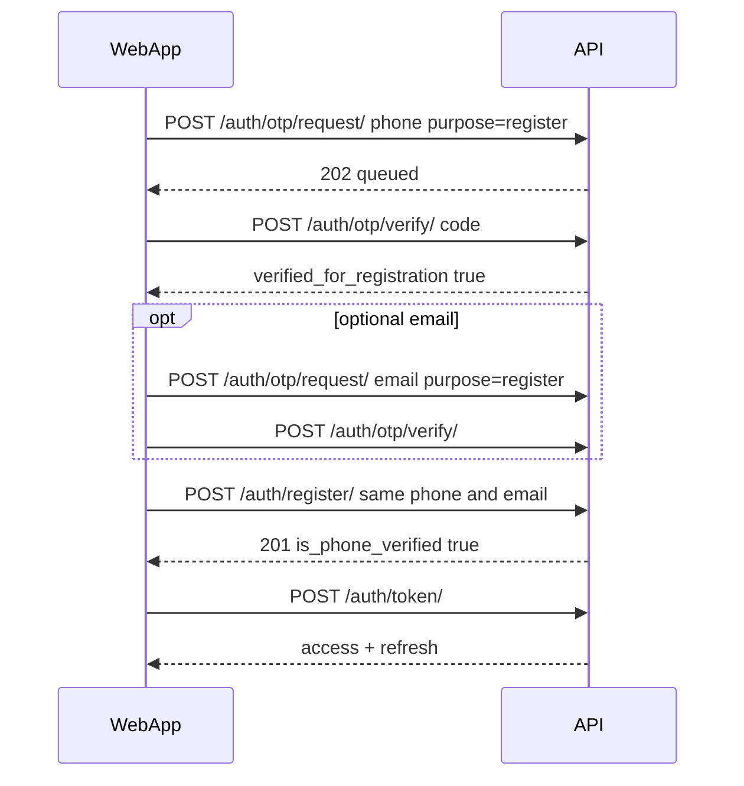
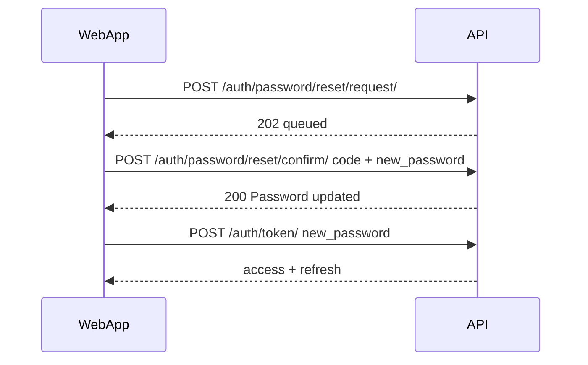

# Phase 1 — Identity and authentication (web)

Handoff guide for the MazadJo web app. Contract details also live in [API.md](../API.md#auth-and-users).

**Prerequisites:** [README.md](README.md) (Phase 0 bootstrap).

---

## Screens covered

| Screen | APIs |
|--------|------|
| Register | `POST /auth/register/` |
| Login | `POST /auth/token/` |
| Forgot password | `POST /auth/password/reset/request/` → `POST /auth/password/reset/confirm/` |
| Verify phone/email (before signup) | `POST /auth/otp/request/` → `POST /auth/otp/verify/` with `purpose=register` |
| Check verification (UI) | `POST /auth/otp/verification-status/` |
| Verify phone/email (logged in) | `purpose=verify_phone` / `verify_email` with JWT |
| Profile | `GET/PATCH /users/me/` |
| Session refresh | `POST /auth/token/refresh/` |

**Out of scope (Phase 1b):** KYC document upload and staff review.

---

## Auth matrix

| Endpoint | Auth |
|----------|------|
| `POST /auth/register/` | Public |
| `POST /auth/token/` | Public |
| `POST /auth/token/refresh/` | Public (refresh token body) |
| `POST /auth/token/verify/` | Public |
| `POST /auth/password/reset/request/` | Public |
| `POST /auth/password/reset/confirm/` | Public |
| `POST /auth/otp/request/` | Public only if `purpose=register`; else JWT |
| `POST /auth/otp/verify/` | Public |
| `GET/PATCH /users/me/` | JWT |

**Staff UI:** use Django `is_staff=True` on the user account (not `user_type` alone).

---

## Web client patterns

### Token storage

1. `POST /api/v1/auth/token/` with `username` + `password`.
2. Store `access` and `refresh` (memory or `sessionStorage`; avoid `localStorage` if your security policy requires).
3. Send `Authorization: Bearer <access>` on protected routes.
4. On **401** with `error.code === "account_disabled"`, clear tokens and show support message.
5. On other **401**, call `POST /auth/token/refresh/` once, retry the request, then logout if refresh fails.

### Login identifier

MVP uses **username + password** only (no phone/email login endpoint).

### Profile image

`profile_image` is an HTTPS URL string on `PATCH /users/me/` (no upload API in Phase 1).

---

## Recommended flows

### Sign up with verified phone and/or email

If the user submits `phone_number` and/or `email` on register, that destination **must** be OTP-verified first (`purpose=register`). Verification is valid for `REGISTRATION_OTP_MAX_AGE_MINUTES` (default 30).



If register is called with an unverified phone/email, the API returns **400** with `error.details.phone_number` or `error.details.email`.

Username-only signup (no phone, no email) is still allowed.

### Forgot password



`destination_type` / `destination_value` must match a user’s **email** or **phone_number** on file.

---

## Error envelope

Errors use:

```json
{
  "error": {
    "code": "account_disabled",
    "message": "This account is disabled.",
    "details": null,
    "request_id": "uuid"
  }
}
```

| code | HTTP | When |
|------|------|------|
| `account_disabled` | 401 / 403 | `is_blocked` or `is_active=false` on login, JWT use, or reset |
| `invalid_otp` | 400 | Wrong/expired OTP on password reset confirm |
| `authentication_failed` | 401 | Bad credentials |
| `validation_error` | 400 | Serializer field errors in `details` |

Send optional `X-Request-ID` from the web app; the server echoes it in `request_id` when provided.

---

## Dev shortcuts

| Setting | Effect |
|---------|--------|
| `FIXED_OTP=True` | OTP code is always `1111` |
| `OTP_RATE_LIMIT_*` | Throttle repeated OTP requests |

---

## Acceptance checklist

```bash
# From repo root
.venv/bin/python manage.py test accounts.tests.test_api_integration accounts.tests.test_auth_phase1 -v2
```

Manual:

- [ ] Register → token → `GET /users/me/`
- [ ] `FIXED_OTP=True`: verify phone flow updates `is_phone_verified`
- [ ] Password reset changes password and new login works
- [ ] Blocked user cannot login or call `/users/me/` with old JWT

---

## Next phase

[02-reference-catalog.md](02-reference-catalog.md) (Phase 2 — geo and categories).
