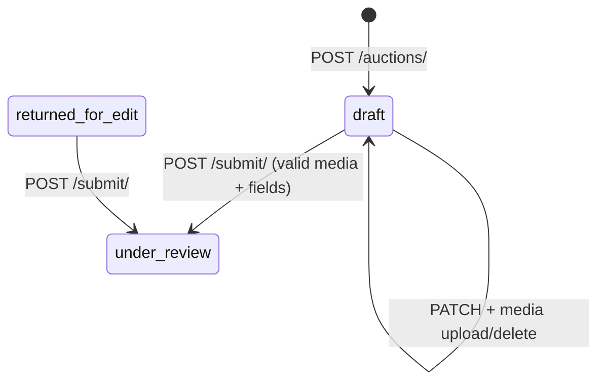

# Phase 3 — Listings, media, and discovery (web)

Handoff guide for the seller listing wizard, buyer browse/search, and auction detail gallery. Contract details: [API.md](../API.md#auctions-and-bids).

**Prerequisites:** [README.md](README.md) (Phase 0), [01-identity-and-auth.md](01-identity-and-auth.md) (JWT for seller flows), [02-reference-catalog.md](02-reference-catalog.md) (geo + category `settings`).

---

## Screens covered

| Screen | APIs |
|--------|------|
| Seller create/edit draft | `POST/PATCH /auctions/` |
| Media wizard step | `POST /auctions/{id}/media/`, `DELETE /auctions/{id}/media/{media_id}/` |
| Submit for review | `POST /auctions/{id}/submit/` (Phase 4 extends checklist gate) |
| Buyer browse cards | `GET /auctions/` → `primary_media_url` |
| Buyer search/filter | `GET /auctions/?search=&category=&area=` |
| Auction detail gallery | `GET /auctions/{id}/` → `media_items[].url`; load bytes via serve URL |
| My listings | `GET /auctions/?mine=1` |

---

## Auth matrix

| Endpoint | Auth |
|----------|------|
| `GET /auctions/` | Public (browse statuses only) |
| `GET /auctions/?mine=1` | JWT (seller's rows, any status) |
| `POST /auctions/` | JWT |
| `GET /auctions/{id}/` | Public for browseable statuses; owner/staff for drafts |
| `PATCH /auctions/{id}/` | JWT owner, draft/`returned_for_edit` only |
| `POST /auctions/{id}/media/` | JWT owner, draft/`returned_for_edit` only |
| `GET /auctions/{id}/media/{media_id}/` | Public when auction is browseable; owner/staff for pre-publish |
| `DELETE /auctions/{id}/media/{media_id}/` | JWT owner, draft/`returned_for_edit` only |
| `POST /auctions/{id}/submit/` | JWT owner |

---

## Media storage model

Binary files are stored in Postgres (`AuctionMedia.file_data`). **Never** expect `file_data` in JSON — list/detail expose metadata plus a **`url`** serve path.

Serve URL pattern:

```http
GET /api/v1/auctions/{auction_id}/media/{media_id}/
```

Response: raw bytes with `Content-Type` from upload (e.g. `image/png`).

Max upload size: **`AUCTION_MEDIA_MAX_BYTES`** (default 10 MB). Configure in `.env`.

---

## Endpoints

Base: `/api/v1/`.

### Create / update draft

```http
POST /auctions/
Authorization: Bearer <access>
Content-Type: application/json

{
  "product_category": 2,
  "title": "iPhone 14 Pro",
  "description": "256GB, excellent condition",
  "area": 5,
  "location_link": "",
  "start_price": "500.00",
  "reserve_price": "800.00",
  "min_bid_increment": "25.00",
  "starts_at": "2026-06-01T10:00:00Z",
  "ends_at": "2026-06-03T22:00:00Z"
}
```

Server sets `status=draft`, `auction_number`, `current_price=start_price`. If `min_bid_increment` is omitted, defaults from category `settings.min_bid_increment`.

Field validation against category `settings` runs on create, update, and submit (prices, reserve, location link, media counts).

### Upload media (multipart)

```http
POST /auctions/{id}/media/
Authorization: Bearer <access>
Content-Type: multipart/form-data

file=<binary>
media_type=image|video|file
sort_order=0
is_blurred=false
```

**201** response (no `file_data`):

```json
{
  "id": 12,
  "media_type": "image",
  "file_type": "image/png",
  "file_name": "photo.png",
  "is_blurred": false,
  "sort_order": 0,
  "url": "http://localhost:8000/api/v1/auctions/3/media/12/"
}
```

### Web upload snippet

```javascript
const form = new FormData();
form.append("file", fileInput.files[0]);
form.append("media_type", "image");
form.append("sort_order", "0");

await fetch(`/api/v1/auctions/${auctionId}/media/`, {
  method: "POST",
  headers: { Authorization: `Bearer ${accessToken}` },
  body: form,
});
```

### List card image

```jsx

```

`primary_media_url` is the serve URL of the first image (`sort_order`, then `id`). `null` when no images.

### List / detail media shape

```json
"media_items": [
  {
    "id": 12,
    "media_type": "image",
    "file_type": "image/png",
    "file_name": "photo.png",
    "is_blurred": false,
    "sort_order": 0,
    "url": "http://localhost:8000/api/v1/auctions/3/media/12/"
  }
]
```

### Browse filters

| Query | Effect |
|-------|--------|
| _(default)_ | Public statuses only (`scheduled`, `active`, `ended`, …) — **no drafts** |
| `mine=1` | Authenticated seller's auctions (all statuses) |
| `status=` | Public users: only browse statuses; staff: any status |
| `category=` | Filter by `product_category` id |
| `area=` | Filter by `area` id |
| `search=` | Case-insensitive match on **title and description** |

---

## Wizard field matrix (from category `settings`)

| Setting | Enforced when | UI |
|---------|---------------|-----|
| `min_images_count` | submit | Block submit until enough images uploaded |
| `max_images_count` | upload | Disable add when at cap |
| `video_allowed` | upload | Hide video option when false |
| `attachments_allowed` | upload | Hide file attachments when false |
| `allowed_extensions_json` | upload | Client `accept` + server 400 |
| `location_link_enabled` | create/update/submit | Require `location_link` when true |
| `min_start_price` | create/update/submit | Floor on `start_price` |
| `reserve_price_required` | create/update/submit | Require `reserve_price` |
| `min_bid_increment` | create (default) | Pre-fill bid step field |
| `blur_option_enabled` | upload | Show blur toggle when true |

---

## State machine (seller draft)



Full staff lifecycle: [04-auction-lifecycle.md](04-auction-lifecycle.md) (Phase 4).

---

## Error codes

| Scenario | HTTP | `error.code` | `error.details` |
|----------|------|--------------|-----------------|
| Missing category settings | 400 | `validation_error` | `product_category` |
| Start price below minimum | 400 | `validation_error` | `start_price` |
| Reserve required but missing | 400 | `validation_error` | `reserve_price` |
| Location link required | 400 | `validation_error` | `location_link` |
| Too few images on submit | 400 | `validation_error` | `media_items` |
| Too many images / bad extension | 400 | `validation_error` | `media_type` / `file` |
| Upload on non-editable status | 403 | `permission_denied` | — |
| Serve draft media (non-owner) | 404 | `not_found` | — |
| File too large | 400 | `validation_error` | `file` |

---

## Polling vs realtime

Not applicable for listings MVP. Detail **`views_count`** increments on each `GET /auctions/{id}/` (no session deduplication in MVP).

---

## Environment / dev shortcuts

| Variable | Purpose |
|----------|---------|
| `AUCTION_MEDIA_MAX_BYTES` | Max upload size (default 10485760) |
| `CORS_ALLOWED_ORIGINS` | Web app origin for cross-origin `` + fetch |

Local dev: proxy `/api/v1` via Vite/Next to avoid CORS on JSON; serve URLs work as same-origin `` when proxied.

---

## Acceptance checklist

```bash
python manage.py migrate
python manage.py seed_catalog
python manage.py test auctions.test_media_api auctions.test_draft_list_api auctions.test_status_visibility_api -v2
```

Manual:

1. Login as seller → `POST /auctions/` draft.
2. Upload ≥ `min_images_count` images via multipart.
3. `GET /auctions/?mine=1` shows draft; anonymous `GET /auctions/` does **not**.
4. `POST /submit/` succeeds with valid media; fails with too few images.
5. Staff publish (Phase 4) → public list shows `primary_media_url`; anonymous can `GET` serve URL.

---

## Open questions / deferrals

| Topic | Decision |
|-------|----------|
| Video duration (`max_video_duration_sec`) | Not server-validated in MVP — client-side only |
| Session-unique view counts | Increment every detail GET |
| Object storage migration | Deferred; binary-in-DB for MVP |
| Avatar upload | Reuse media pattern later; Phase 1 uses URL on profile |

---

## Next phase

[04-auction-lifecycle.md](04-auction-lifecycle.md) — submit gate with review checklist, staff approve/publish, cancel, audit.
