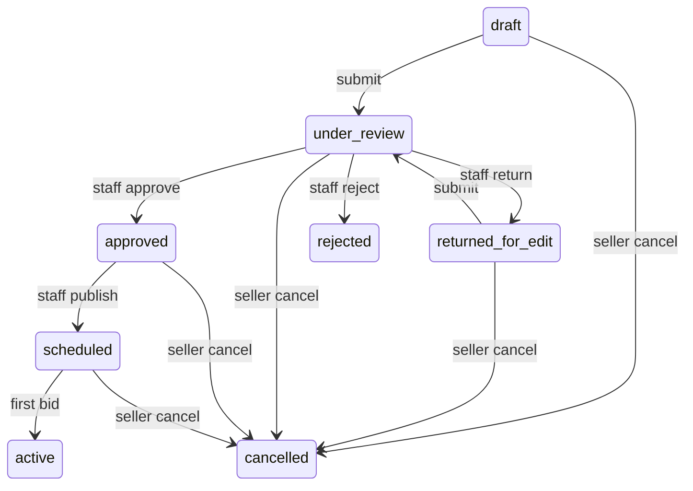

# Phase 4 — Auction lifecycle (web)

Handoff guide for submit → staff review → publish, seller cancel, and audit. Contract details: [API.md](../API.md#auctions-and-bids).

**Prerequisites:** [Phase 3 — Listings and media](03-listings-and-media.md).

**Checklist templates:** configured in [03-cms-and-configuration.md](03-cms-and-configuration.md) (`checklist-items`, category assignment).

---

## Screens covered

| Screen | APIs |
|--------|------|
| Seller submit for review | `POST /auctions/{id}/submit/` |
| Seller cancel listing | `POST /auctions/{id}/cancel/` (**owner only — no staff cancel**) |
| Staff review queue | `GET /auctions/?status=under_review` |
| Staff checklist console | `GET/PATCH /auctions/{id}/review-checklist/` |
| Staff decision | `POST /auctions/{id}/staff/review/` |
| Staff publish | `POST /auctions/{id}/staff/publish/` |
| Staff audit trail | `GET /audit-logs/?entity_type=auction` |

---

## Auth matrix

| Endpoint | Auth |
|----------|------|
| `POST /auctions/{id}/submit/` | JWT owner |
| `POST /auctions/{id}/cancel/` | JWT owner only (not staff) |
| `GET/PATCH /auctions/{id}/review-checklist/` | Staff JWT |
| `POST /auctions/{id}/staff/review/` | Staff JWT |
| `POST /auctions/{id}/staff/publish/` | Staff JWT |
| `GET /audit-logs/` | Staff JWT |

---

## Review checklist flow

Checklist is **already defined in `configuration`**:

1. Staff creates template items: `GET/POST /checklist-items/`
2. Staff assigns to category: `PUT /categories/{id}/checklist-items/` with `{"checklist_item_ids": [1, 2]}`
3. On **submit**, rows are snapshotted onto the auction (`ensure_auction_review_checklist`)
4. Staff checks items: `PATCH /auctions/{id}/review-checklist/` body `{"id": <row_id>, "is_checked": true}`
5. On **approve**, server validates **all** snapshotted rows are checked

Reject and return-for-edit do **not** require a complete checklist.

### Approve validation error

```json
{
  "error": {
    "code": "validation_error",
    "message": "All checklist items must be checked before approval. Unchecked: title_ok",
    "details": {
      "review_checklist": [
        "All checklist items must be checked before approval. Unchecked: title_ok"
      ]
    }
  }
}
```

Categories with **no** assigned checklist items skip the approve gate.

---

## Staff review

```http
POST /auctions/{id}/staff/review/
Authorization: Bearer <staff_access>
Content-Type: application/json

{
  "decision": "approve",
  "reason": ""
}
```

| `decision` | New status | Checklist required |
|------------|------------|-------------------|
| `approve` | `approved` | Yes — all items checked |
| `reject` | `rejected` | No |
| `return_for_edit` | `returned_for_edit` | No |

Auction must be in `under_review`.

---

## Publish

```http
POST /auctions/{id}/staff/publish/
Authorization: Bearer <staff_access>
```

- Requires `approved`
- Validates `ends_at` > `starts_at`
- Sets `status=scheduled`, `origin_deadline=ends_at` (if not already set)
- Listing becomes visible on public browse (`GET /auctions/`)

---

## Seller cancel (owner only)

**There is no staff/admin cancel endpoint.** Only the listing creator may cancel.

```http
POST /auctions/{id}/cancel/
Authorization: Bearer <seller_access>
Content-Type: application/json

{"reason": "optional note"}
```

| Current status | Can cancel? |
|----------------|-------------|
| `draft` | Yes |
| `returned_for_edit` | Yes |
| `under_review` | Yes (withdraw) |
| `approved` | Yes (before publish) |
| `scheduled` | Yes (before first bid / active) |
| `active`, `ended`, … | No |

Staff users receive **403** if they attempt cancel (even with staff JWT).

---

## Status machine



---

## Audit log

Lifecycle actions write rows to `audit_logs`:

| Action | Trigger |
|--------|---------|
| `staff_review_approve` | Staff approve |
| `staff_review_reject` | Staff reject |
| `staff_review_return_for_edit` | Staff return |
| `staff_publish` | Staff publish |
| `seller_cancel` | Owner cancel |

Query: `GET /audit-logs/?entity_type=auction&entity_id=<id>` (staff JWT).

---

## Timeline fields

| Field | Set when | Use |
|-------|----------|-----|
| `starts_at` | Seller draft | Scheduled go-live |
| `ends_at` | Seller draft | Original end; anti-sniping extends via `extend_deadline` |
| `origin_deadline` | Publish | Snapshot of original end before extensions |
| `actual_end_at` | Close | When auction actually ended |

---

## Error codes

| Scenario | HTTP | `error.details` |
|----------|------|-----------------|
| Approve with unchecked checklist | 400 | `review_checklist` |
| Review when not `under_review` | 400 | `status` |
| Publish when not approved | 400 | `status` |
| Publish with past `starts_at` | 400 | `starts_at` |
| Cancel when live/ended | 400 | `status` |
| Cancel by non-owner (staff) | 403 | — |

---

## Acceptance checklist

```bash
python manage.py test auctions.test_lifecycle_api configuration.tests.test_review_checklist -v2
```

Manual E2E:

1. Seller: draft → upload media → submit
2. Staff: check all checklist rows → approve → publish
3. Public `GET /auctions/` shows `scheduled` listing
4. Seller: cancel a `scheduled` listing → `cancelled`
5. Staff: `GET /audit-logs/` shows review/publish/cancel entries

---

## Next phase

[05-subscriptions-and-payments.md](05-subscriptions-and-payments.md) — staging subscribe + `mark_paid`.
