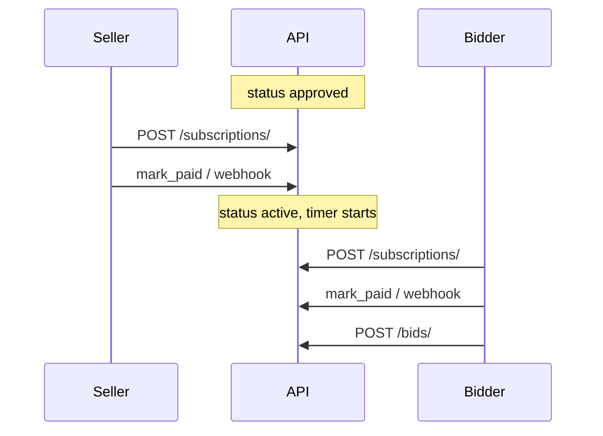

# Phase 5 — Subscriptions, payments, and auction activation (web)

Handoff guide for seller pay-to-activate, bidder join fees, and staging payments. Contract: [API.md](../API.md#subscriptions).

**Prerequisites:** [Phase 4 — Auction lifecycle](04-auction-lifecycle.md) (staff approve). This phase **supersedes** staff publish and date-based draft scheduling.

**Payments:** Staging-only — `mark_paid` and test webhook. No checkout URL in MVP.

---

## Product rules

| Topic | Rule |
|-------|------|
| Role field | **None** — server infers `seller` if `user.id == auction.seller_id`, else `bidder` |
| Seller fees | `seller_insurance_amount + subscription_amount` from category `fees` |
| Bidder fees | `bidder_insurance_amount + subscription_amount` |
| Seller subscribe | Only when auction is **`approved`** |
| Bidder subscribe | Only when auction is **`active`** |
| Go live | Seller payment → `status=active`, `ends_at = paid_at + duration_days` |
| Draft scheduling | Seller sets **`duration_days`** only (no start/end on create) |

---

## Screens

| Screen | APIs |
|--------|------|
| Seller pay to activate | `POST /subscriptions/` → `POST /subscriptions/{id}/mark_paid/` (simulate) or webhook |
| Bidder join auction | `POST /subscriptions/` on `active` auction → `mark_paid` (simulate) or webhook |
| Payment waiting | `GET /subscriptions/?auction=&status=` |
| Account payments | `GET /payments/transactions/?auction=` |
| Staging simulate pay | `POST /subscriptions/{id}/mark_paid/` (own subscription only) |

---

## Fee preview (before subscribe)

From `GET /categories/` nested `fees`:

```json
"fees": {
  "bidder_insurance_amount": "2.00",
  "seller_insurance_amount": "10.00",
  "subscription_amount": "5.00"
}
```

- Seller total: **15.00** (10 + 5)
- Bidder total: **7.00** (2 + 5)

---

## Subscribe

```http
POST /api/v1/subscriptions/
Authorization: Bearer <access>
Content-Type: application/json

{"auction": 3}
```

Optional header: `Idempotency-Key` (replay returns same pending row).

**201 response:**

```json
{
  "id": 1,
  "auction": 3,
  "status": "pending_payment",
  "insurance_fee": "10.00",
  "subscription_fee": "5.00",
  "total_fee": "15.00",
  "participant_type": "seller",
  "payment_transaction": {
    "id": 9,
    "provider_reference": "sub-1-abc123",
    "status": "pending",
    "amount": "15.00"
  }
}
```

`participant_type` is read-only (`seller` | `bidder`).

---

## Staging activation

```bash
# After POST /subscriptions/
curl -X POST http://127.0.0.1:8000/api/v1/subscriptions/1/mark_paid/ \
  -H "Authorization: Bearer <access>"
```

Or test webhook (see `WEBHOOK_PAYMENT_SECRET` in `.env.example`).

**Seller:** subscription `active` + auction `active` with `starts_at` / `ends_at` set.

**Bidder:** subscription `active` only.

---

## Polling

```http
GET /api/v1/subscriptions/?auction=3&status=active
```

Poll every 2–5s until `status === "active"` or timeout.

---

## Bidding gate

Without active subscription:

```http
POST /api/v1/auctions/{id}/bids/
→ 403
```

```json
{
  "error": {
    "code": "subscription_required",
    "message": "Active subscription required to bid."
  }
}
```

---

## Draft wizard change

Create/update draft with **`duration_days`** (integer ≥ 1). Do **not** send `starts_at` / `ends_at` — they are set when the seller pays.

```json
{
  "product_category": 2,
  "title": "My listing",
  "duration_days": 7,
  "start_price": "100.00",
  "min_bid_increment": "10.00"
}
```

---

## Lifecycle (after Phase 4 approve)



---

## Error codes

| Scenario | HTTP | `error.details` / `code` |
|----------|------|--------------------------|
| Seller subscribe before approve | 400 | `auction` |
| Bidder subscribe before active | 400 | `auction` |
| Duplicate subscription | 400 | `auction` |
| Bid without subscription | 403 | `subscription_required` |

---

## Acceptance

```bash
python manage.py test subscriptions.tests auctions.test_draft_list_api auctions.test_lifecycle_api bidding.tests -v2
```

---

## Next phase

[06-live-bidding-realtime.md](06-live-bidding-realtime.md)
